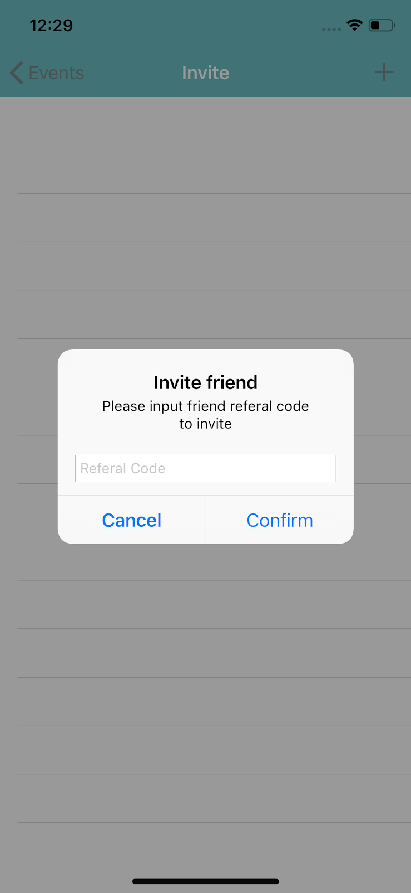

# SocialWithMe
An prototype app created for Innofest 2018 within 24 hours.
# Theme
Recreation and leisure(focus on entertainment and enjoyment, recreational and leisure elements)
# Problem
The elderly lack affordable options of suitable activities due to limitations, lack social interaction and wish to have lesser dependency on others in activities.
# Proposed solution
An app that provides users with suggested activities and nearby possible locations, allowing them to organise events to do with other users.
# App fucntions
- Numerous activity suggestions
- Ability to organise activities open to others
- Verification of activities to redeem points through submitting images as proof
- Scrapbooking function
- Invite and follow others with similar interests
- Find others near you
# Note
As this app is an prototype done within 24 hours, some of the features may not have been implemented like for example the system for redemption of points.The app is also purely offline.
# Screenshots

# Credits
Prototype developer and UI designer:Yan En  
Art:Rhea  
Fellow teammates:Matthew,Aisyah,Shaun  

